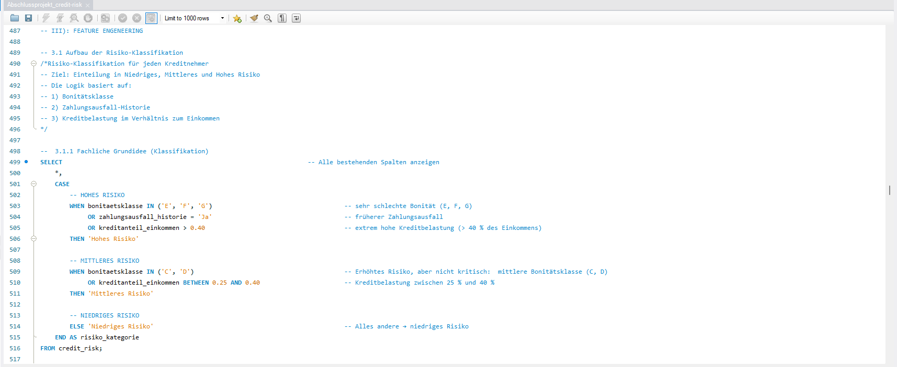
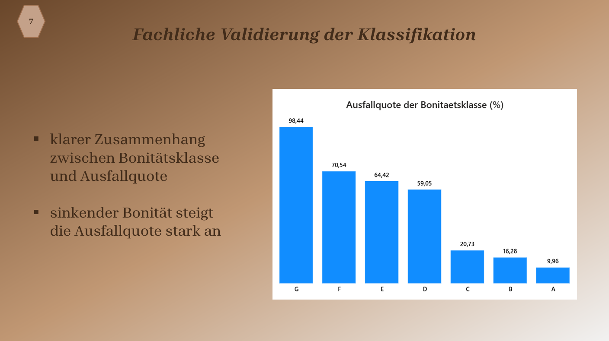

# Credit Risk Analysis

## Project Overview
This project analyzes credit risk data to identify factors that influence the probability of loan default.  
The goal is to explore financial data and detect patterns that can help financial institutions make better lending decisions.

---

## Objectives
- Analyze customer financial data
- Identify key factors associated with credit risk
- Explore patterns that may lead to loan default
- Support data-driven decision making in financial services

---

## Tools & Technologies
- SQL
- Data Analytics
- Exploratory Data Analysis (EDA)

---

## Analysis Process
1. Data cleaning and preparation
2. Exploratory data analysis using SQL queries
3. Identification of important risk indicators
4. Interpretation of patterns related to loan default risk

---
## Model Validation

The classification results were validated by analyzing the relationship between credit rating classes and default rates.

---

### Key Insight
Lower credit rating classes show significantly higher default rates, confirming the predictive power of the model.

## Key Insights
- Certain financial indicators are strongly associated with higher credit risk.
- Customer financial behavior plays an important role in predicting loan default.
- Data analytics can support financial institutions in improving credit risk assessment.

---

## Repository Structure
